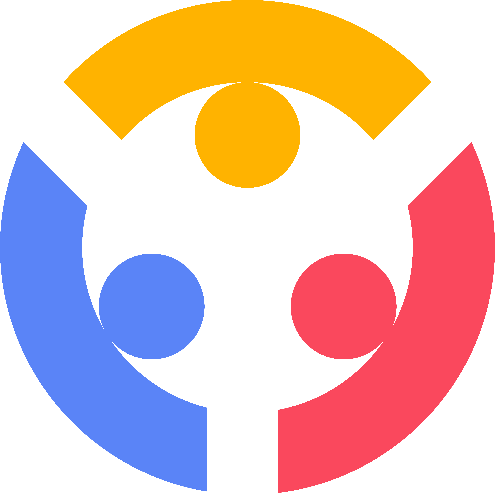

<p align="center">
  
</p>

<h1 align="center">
  <br>
  Centralized Barangay Assistance & Reporting Platform
</h1>

<p align="center">
  <b>Empowering communities through faster response, transparency, and digital governance.</b><br>
  Built with <b>Flutter</b> + <b>Firebase</b> for a smarter, more connected barangay system.
</p>

<p align="center">
  
  
  
  
</p>

---

## 🎯 Overview

**TUGON** (meaning *“response”* in Filipino) is a proposed **centralized barangay service mobile application** that enables **residents and officials to connect, report incidents, and access community services seamlessly**.

It supports **multiple barangays** (e.g., Alangilan & Tinga Itaas) through **one shared system**, promoting:

- ⚡ **Efficiency** – faster processing of reports and requests
- 🔍 **Transparency** – clear visibility of services and response actions
- ⏱️ **Quick Response Times** – enabling authorities to act promptly on incidents

> 🧩 *TUGON embodies the spirit of unity, readiness, and digital empowerment for communities, ensuring every resident can be heard and helped quickly.*

---

## 🎯 Project Objectives

**Main Objective:**  
To develop a centralized digital platform for barangay-level incident reporting and assistance coordination.

**Specific Objectives:**
- Streamline barangay service requests and reports through verified user accounts.
- Provide real-time announcements, alerts, and events to residents.
- Enable digital verification for residency and documents.
- Support multi-barangay coordination and communication.

---

## 🌍 Sustainable Development Goals (SDGs) Supported

| SDG | Badge | Description |
| :-- | :---- | :----------- |
| 🏭 **SDG 9 – Industry, Innovation, and Infrastructure** |  | Fosters **innovation and digital infrastructure** by connecting multiple barangays for efficient service management. |
| ⚖️ **SDG 10 – Reduced Inequalities** |  | Ensures **equal access to services** for all residents, reducing disparities in response times and assistance. |
| 🏙️ **SDG 11 – Sustainable Cities and Communities** |  | Enhances **transparency and coordination**, contributing to safer, more resilient communities. |
| 🕊️ **SDG 16 – Peace, Justice, and Strong Institutions** |  | Strengthens **local governance and accountability**, promoting trust and institutional transparency. |

---

## 🗓️ Project Timeline

| Month | Milestone |
| :---- | :--------- |
| **September 2025** | Project ideation and proposal |
| **October 2025** | Data gathering and early development |
| **November 2025** | Feature integration |
| **December 2025** | Finalization and testing |

---

## ✅ Feature Implementation Status

| Feature | Description | Status |
| :------ | :----------- | :----: |
| **Authentication** | Email/password and Google Sign-In for users | 🟢 Completed |
| **Multi-step Registration Flow** | Location and barangay residency verification | 🟢 Completed |
| **Email Verification** | Uses Brevo API and Firestore code verification | 🟢 Completed |
| **User Management** | Firestore-based user records per barangay | 🟢 Completed |
| **Admin Dashboard** | Barangay-level management of users and posts | 🟡 In Progress |
| **Announcements Module** | Posting and viewing barangay announcements | 🟡 In Progress |
| **Incident Reports** | Private resident reports sent to officials | 🔴 Planned |
| **Document Requests** | Certificate and permit requests | 🔴 Planned |
| **Notification Center** | Real-time alerts and system updates | 🔴 Planned |
| **Vulnerable Area Mapping** | Flood-prone and evacuation maps | 🔴 Planned |
| **Push Notifications** | Firebase Cloud Messaging for alerts | 🔴 Planned |

---

## 🖼️ Screenshots

| Screen | Screenshot |
| :----- | :---------- |
| Splash Screen |  |
| Onboarding Screen |  |
| Login Screen |  |
| Admin Screen |  |
| Forgot Password Screen |  |
| Location Selection Screen |  |
| Residency Check Screen |  |
| Registration Form Screen |  |
| Email Verification Screen |  |
| Pending Approval Screen |  |

---

## ⚙️ How to Run the App

### 1️⃣ Clone the Repository

```bash
git clone <repo-url>
cd TUGON-App
git checkout main
```

### 2️⃣ Install Dependencies

```bash
flutter pub get
```

### 3️⃣ Configure Firebase

1. Create a **Firebase project** in the console.
2. Add **Android and/or iOS apps** to the project.
3. Download and place the config files:

   * `android/app/google-services.json`
   * `ios/Runner/GoogleService-Info.plist`
4. Enable the following Firebase services:

   * **Firestore**
   * **Authentication** (Email/Google Sign-In)
   * **Cloud Messaging**

### 4️⃣ Run the App

```bash
flutter run
```

> ⚡ The app should launch on your connected device or simulator with full functionality.

---

## 📌 Notes / Recommendations

* Ensure **Flutter v3.24** is installed.
* Confirm **Firebase services** are properly configured before running.
* Admin functionality may require **manual Firestore role assignments**.

---

## 👥 Developers

| Name                       | GitHub                                                     |
| :------------------------- | :--------------------------------------------------------- |
| **Alcaraz, John**          | https://github.com/JohnAlcaraz02 |
| **Carranza, John Timothy** | https://github.com/Carranza-John-Timothy |
| **Donayre, Aila Roshiele** | https://github.com/ailadonayre |
| **Ramirez, Kent Ian**      | https://github.com/KentRamriez |
| **Rivera, Irish**          | https://github.com/kelleeerrrr |

---

## 🧑‍🏫 Instructor & Course Information

| Detail            | Information                                                |
| :---------------- | :--------------------------------------------------------- |
| **Course**        | Application Development and Emerging Technologies (IT 331) |
| **Instructor**    | Prof. Sean Mark Segui                                      |
| **Academic Term** | 1st Semester, A.Y. 2025–2026                               |

---

<p align="center" style="font-size:15px;">
  💡 <b style="color:#5A84F7; font-size:20px;">
    Empowering Communities. Strengthening Connections. Building the Future with
  </b>
  
</p>


